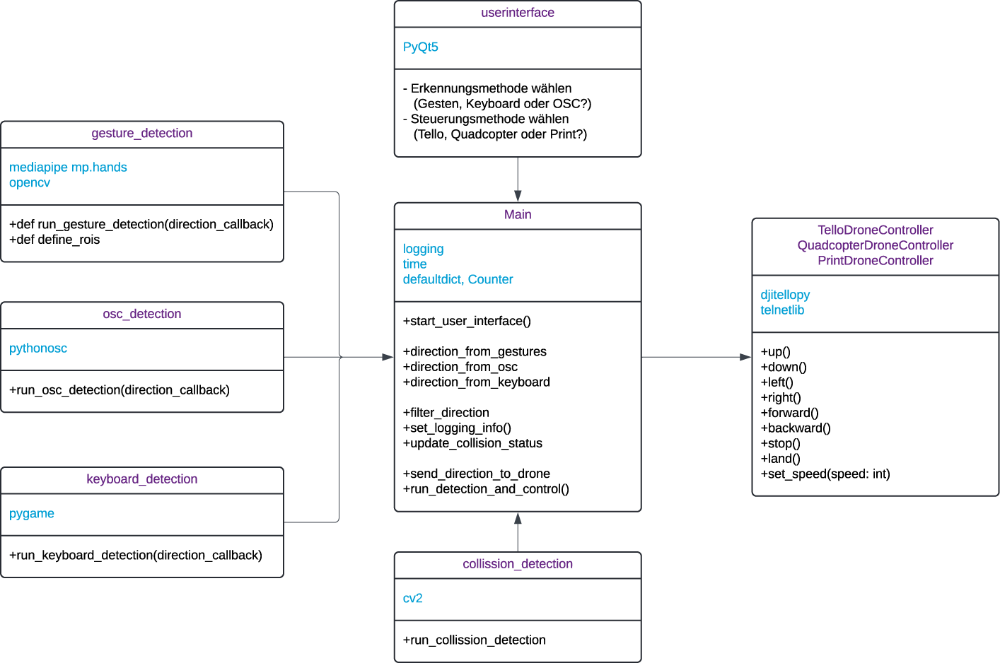

# DroneVerse

Mit dem hier bereitgestellten Code ist es möglich, verschiedene Drohennsteuerungen mit verschiedenen Drohnen zu kombinieren und durch einen Hindernis-Parcours zu navigieren. Über ein UserInterface wird ausgewählt, welche Steuerung man haben möchte: Gestenerkennung, Handysteuerung (Ausrichtung des Handys im Raum) oder Tastatursteuerung. Außerdem kann man aktuell zwischen Tello Drohnen und Quadkoptern wählen. Für die Quadkopter ist ein eigener Aufbau nötig.

Das Projekt wurde im Rahmen des Studiums Media Engineering der Technischen Hochschule Nürnberg im 5. und 6. Semester erstellt. Die Aufgabenstellung war "Interaktive Drohnensteuerung mit Luftballons".

Eine detaillierte Beschreibung des Projekts findet sich im Projektbericht: https://faubox.rrze.uni-erlangen.de/getlink/fi8aWHq5cp2sDt69WiMZJu/Projektbericht_DroneVerse_2.pdf

Alle Medien wie Fotos, Videos sowie der Zwischenbericht findet sich hier: https://faubox.rrze.uni-erlangen.de/getlink/fiRL1DiZmdD7DsQrgofr74/

# Mitwirkende

- Sina Steinmüller
- Tobias Schwarz
- Maximilian Richter
- Lisa Berbig
- Anusha Kanagarasa
- Katharina Hölzl

Betreuer: Prof. Dr. (USA) Ralph Lano
Für weitere Fragen: steinmuellersi89050@th-nuernberg.de

# Main.py

Das Skript main.py dient als zentrale Steuerungseinheit für ein Drohnenkontrollsystem. Es integriert verschiedene Module zur Erkennung von Steuerbefehlen sowie zur Kontrolle der Drohne. Im Folgenden wird die Funktionsweise des Skripts erläutert:



## Importieren der Erkennungs- und Kontrollmodule:

- run_gesture_detection: Funktion zur Erkennung von Gesten.
- run_osc_detection: Funktion zur Erkennung von Open Sound Control (OSC) Signalen.
- run_keyboard_detection: Funktion zur Erkennung von Tastatureingaben.
- PrintDroneController: Controller zur Ausgabe der Steuerbefehle auf der Konsole.
- TelloDroneController: Controller zur Steuerung einer Tello-Drohne.
- QuadkopterDroneController: Controller zur Steuerung einer Tello-Drohne.

## Globale Variablen zur Auswahl der Erkennungs- und Kontrollmethode:

- chosen_detection: Bestimmt, welche Erkennungsmethode verwendet wird. Mögliche Werte sind "gestures", "osc", und "keyboard".
- chosen_control: Bestimmt, welcher Controller verwendet wird. Mögliche Werte sind "print", "tello" und "quadkopter".

## Funktionen zur Verarbeitung der Erkennungsergebnisse:

- direction_from_gestures(direction): Verarbeitet Richtungsbefehle, die durch Gestenerkennung ermittelt wurden.
- direction_from_osc(direction): Verarbeitet Richtungsbefehle, die durch OSC-Signale ermittelt wurden.
- direction_from_keyboard(direction): Verarbeitet Richtungsbefehle, die durch Tastatureingaben ermittelt wurden.

## Funktion zur Weiterleitung der Richtungsbefehle an den Drohnencontroller:

- send_direction_to_drone(direction): Leitet die erkannten Richtungsbefehle an den entsprechenden Drohnencontroller weiter, basierend auf der Auswahl von chosen_control.

## Hauptprogramm:

Das Skript startet eine Benutzeroberfläche und initialisiert die ausgewählte Erkennungsmethode (gesture, osc, oder keyboard).
Je nach Auswahl wird die entsprechende Erkennungsfunktion gestartet, welche die Richtungsbefehle an die zuvor definierten Verarbeitungsfunktionen weiterleitet.

# gesturedetection.py

Das Python-Modul führt eine Gestenerkennung durch, die auf Mediapipe und OpenCV basiert. Hier ist eine Zusammenfassung dessen, was das Modul tut:

## Importe und Initialisierung:

Das Modul importiert die Bibliotheken cv2 (OpenCV) und mediapipe. Es initialisiert Mediapipe für die Handgestenerkennung und konfiguriert es für die Verarbeitung von Bildern von einer Webcam.

- import cv2: Importiert OpenCV für die Bildverarbeitung.
- import mediapipe as mp: Importiert Mediapipe für die Handerkennung.
- mp_hands = mp.solutions.hands: Initialisiert das Hands-Modul von Mediapipe.
- mp_drawing = mp.solutions.drawing_utils: Hilfsfunktionen zum Zeichnen der Hand-Skelettverbindungen.
- hands = mp_hands.Hands(static_image_mode=False, max_num_hands=1): Erstellt eine Instanz des Handerkenners von Mediapipe für die Verarbeitung von Live-Video.

## Hauptfunktion run_gesture_detection:

Diese Funktion ist die Kernfunktion des Moduls. Sie erfasst Frames von der Webcam, verarbeitet sie mit Mediapipe, um Handpositionen zu erkennen, und bestimmt dann die Position des Zeigefingers in vordefinierten Regionen (Region of Interests, ROIs) im Bild.

- Diese Funktion erhält eine Richtungsrückruffunktion (direction_callback), die in main.py definiert ist.
- Öffnet die Kamera und liest Frames.
- Definiert Regionen von Interesse (ROIs) auf dem Bildschirm.
- Startet eine Endlosschleife, um kontinuierlich Frames zu erfassen und zu verarbeiten.
- Konvertiert jeden Frame in das RGB-Format und spiegelt ihn horizontal für eine natürlichere Darstellung.
- Verarbeitet jeden Frame mit dem Handerkennungsmodell von Mediapipe (hands.process(frame_rgb)).
- Zeichnet die ROIs und die erkannten Handlandmarken auf dem Frame.
- Erkennt die Position des Zeigefingers und bestimmt basierend auf dessen Position in den definierten ROIs die Richtung ("up", "down", "left", "right", "forward", "backward").
- Ruft die Richtungsrückruffunktion direction_callback(direction) auf, um die erkannte Richtung an main.py zu übergeben.
- Zeigt den aktuellen Frame mit den Zeichnungen und ROIs in einem Fenster (cv2.imshow) an.
- Überprüft Tastatureingaben für das Beenden des Programms ('q' für Beenden, 's' für Drohnenstart).

### Oben und unten erkennen

- Die Position des Zeigefingers wird durch dessen vertikale Koordinate relativ zum Bildschirm oder einer Referenzebene bestimmt.
- Wenn die vertikale Position des Zeigefingers über einer definierten Grenze (roi_top) liegt, wird die Geste als "oben" erkannt.
- Liegt der Zeigefinger unterhalb einer definierten Grenze (roi_bottom), wird die Geste als "unten" interpretiert.

### Links und rechts erkennen:

- Die horizontale Position des Zeigefingers wird im Vergleich zur Daumenspitze bewertet.
- Wenn die x-Koordinate des Zeigefingers links von der Daumenspitze liegt, wird dies als "links" klassifiziert.
- Liegt der Zeigefinger rechts von der Daumenspitze, wird dies als "rechts" identifiziert.

### Vorwärts und rückwärts erkennen:

- Die Gesten "vorwärts" und "rückwärts" basieren auf der euklidischen Distanz zwischen Daumenspitze und Zeigefingerspitze.
- Ein definierter Schwellwert (treshold_forward) bestimmt, wann die Geste als "vorwärts" interpretiert wird, basierend auf der Nähe der Finger zueinander.
- Ein anderer Schwellwert (treshold_backward) definiert, wann die Geste als "rückwärts" erkannt wird, wenn die Finger weiter voneinander entfernt sind.

# oscdetection.py

Das Skript oscdetection.py ist dafür ausgelegt, Gyroskopdaten von einer iOS-App (Data OSC) zu empfangen, diese zu verarbeiten und die Richtung basierend auf den gemessenen Werten zurückzugeben. Hier ist eine detaillierte Erläuterung der Funktionalitäten:

## Importe und Initialisierungen:

- import argparse: Für die Verarbeitung von Befehlszeilenargumenten.
- from collections import deque: Verwendung von Deques zur - Speicherung und Verwaltung einer begrenzten Anzahl von Gyroskopwerten.
- from pythonosc import dispatcher as osc_dispatcher_module: Import für den OSC-Dispatcher von PythonOSC.
- from pythonosc import osc_server: Import für den OSC-Server von PythonOSC.
- GYRO_FACTOR = 100.0: Faktor zur Skalierung der Gyrowerte für bessere Lesbarkeit.
- HISTORY_SIZE = 500: Anzahl der letzten Gyrowerte, die verwendet werden, um die Richtung zu berechnen.

## Funktion determine_direction:

- Berechnet die Richtung basierend auf durchschnittlichen Gyrowerten über einen definierten Zeitraum.
- Summiert und berechnet den Durchschnitt der Gyrowerte für x, y und z.
- Bestimmt die Richtung basierend auf dem größten absoluten Durchschnittswert (rechts, links, oben, unten, vorwärts, rückwärts).

## Funktion format_osc_value:

- Formatierungsfunktion für OSC-Werte, um sie ohne Nachkommastellen darzustellen.

## Hauptfunktion run_osc_detection:

- Startet einen OSC-Server, der auf eingehende Gyro-Daten von der angegebenen IP-Adresse und Portnummer hört.
- Verwendet Argumente (--ip, --port), die über die Befehlszeile angegeben werden können.
  Initialisiert Deques für die Gyrowerte in den x-, y- und z-Achsen.
- Definiert Handler-Funktionen (gyro_handler_x, gyro_handler_y, gyro_handler_z), die Gyrodaten empfangen und in die entsprechenden Deques einfügen.
- Verwendet einen OSC-Dispatcher, um die OSC-Nachrichten zu den entsprechenden Handler-Funktionen zu verbinden.
- Startet den OSC-Server und beginnt damit, auf eingehende OSC-Nachrichten zu warten und die Gyrowerte zu aktualisieren.
- Aktualisiert die Richtung durch Aufrufen der Funktion update_direction nach jeder neuen Gyrodatenaktualisierung.

## Hauptprogramm (if **name** == "**main**":):

- Definiert eine anonyme Funktion als Rückruffunktion, die die erkannte Richtung in der Konsole ausgibt.
- Startet die Hauptfunktion run_osc_detection mit dieser Rückruffunktion.

Das Skript ermöglicht es, Gyrodaten von einem iOS-Gerät über OSC zu empfangen, diese Daten zu verarbeiten und die ermittelte Bewegungsrichtung an eine andere Anwendung (wie main.py) zurückzugeben. Es bietet eine flexible Möglichkeit, die Bewegung des Geräts als Steuerbefehle zu nutzen, etwa für die Drohnensteuerung oder ähnliche Anwendungen, die Richtungssteuerung erfordern.

## Installation und Steuerung

### Installation auf Apple (iPhone, Macbook)

- Download von Data OSC
- Rausfinden der eigenen Computer IP Adresse (Apple: Systemeinstellungen, WLAN auswählen, Details … )
- Eingabe der eigenen IP Adresse in Data OSC, Port 5005
- Anpassung der IP im Code osc_control, Eingabefeld öffnet bei Start der App
- aktivieren von "Motion / Gyroscope werten

Man bekommt 3 Achsen, X, Y und Z
x: links / rechts
y: hoch / runter
z: vorwärts / rückwärts

### Steuerung

iPhone mit Display nach oben halten, Kamera auf der Linken Seite, Homebutton auf der rechten Seite.

- Rechte iPhone Seite (Homebutton) nach unten kippen: right
- Linke iPhone Seite (Kamera) nach unten kippen: left
- Vordere Längskante nach unten kippen: down
- Hintere Längskante nach unten kippen: up
- iPhone gerade halten (Display oben) und gegen Uhrzeigersinn drehen: forward
- iPhone gerade halten (Display oben) und im Uhrzeigersinn drehen: backward
- ReadMe auf English
- Gesendete nachrichten begrezen je nach Drohne (alle 10ms eine Richtung o.Ä., rausfinden wie viele Daten drohne maximal verarbeiten kann)

# print_dronecontrol.py

Simuliert die Drohnensteuerung mittels Printausgaben, hauptsächlich verwendet zum Testen verschiedener Funktionen und zum erlernen der Steuerung.

# tello_dronecontrol.py

Steuert die DJI Tello drohne entsprechend der gewählten Detection.

# Parcours

highscore.py
ultrasonicsensorTimer.cpp

Dient dazu, eine Zeitmessung im Hindernisparcours zu erstellen. Hierfür wird mit dem Ultraschallsensor der die Zeit gemessen, die der Spieler gebraucht hat. Die erkannte Zeit wird ins highscore.py Skript eingetragen und zeigt die Bestenliste.

# Installation

- VSCode
- Python 3.11.6
- .venv

```shell
pip install -r requirements.txt
```

# ChangeLog
